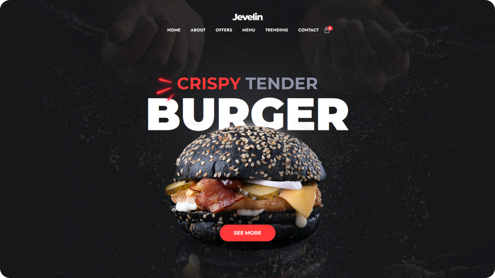

<div align="center">
	<h1>Jevelin Burger Shop</h1>
	<h4>#HTML #BEM #CSS #SCSS #JavaScript</h4>
	
</div>

## 🤖 Introduction
This project is a recreation of the Jevelin Burger Shop website, aimed at providing an improved user experience. I rebuilt it from scratch, resolving issues and adding new features to enhance its functionality. It serves as a comprehensive landing page, offering an engaging information hub with a seamless user interface and captivating visuals. It's important to note that this platform beautifully showcases the essence of the website's content but does not process real orders.

**Copyright Notice:** This recreation is for educational and portfolio demonstration purposes only. Copyright belongs to [Jevelin](https://jevelin.shufflehound.com/hello/)

## ⚙️ Setup
To view this project locally, follow these steps:
1. Clone this repository.
2. Open the ```index.html``` file in your preferred web browser.

### ⭐ You can check out the project Live [here](https://stepan928.github.io/BurgerShop/).